<p align="center">
  
</p>

<p align="center">
  <a href="https://github.com/SaiAkhil066/CORTEX-AI-SUPER-RAG/actions/workflows/tests.yml"></a>
  &nbsp;
  
  &nbsp;
  
  &nbsp;
  
  &nbsp;
  
</p>

<h3 align="center">
  Ask questions about your documents. Get answers that cite the file and page they came from.<br/>
  <sub>Runs entirely on your machine with Ollama. No API key, no cloud upload.</sub>
</h3>

<br/>

Cortex RAG is a local retrieval-augmented generation app. You upload PDFs, Word files or text, and ask questions in plain language. Behind each answer is a hybrid search pipeline (keyword + semantic search, an entity graph, a neural reranker and an LLM relevance check), and every technique can be switched on or off from the sidebar. An evaluation harness lets you measure which ones actually help on your documents, instead of taking this README's word for it.

<p align="center">
  
</p>
<p align="center">
  <sub>An illustration of the steps a question goes through. Real timings depend on your hardware and which steps are on.</sub>
</p>

<br/>

## Quick start

You need [Ollama](https://ollama.com/) installed and running, and Python 3.10 or newer.

```bash
git clone https://github.com/SaiAkhil066/CORTEX-AI-SUPER-RAG.git
cd CORTEX-AI-SUPER-RAG
pip install -r requirements.txt

ollama pull llama3.1:8b          # the chat model (any Ollama model works)
ollama pull nomic-embed-text     # the embedding model (required)

python -m streamlit run app.py   # then open http://localhost:8501
```

Optional: `cp .env.example .env` to change the models, the Ollama URL or where indexes are stored. On Linux, `./install.sh` does the Ollama, model and dependency steps for you.

> **Windows:** if you get a `c10.dll` error on first run, install a stable CPU build of PyTorch:
> `pip uninstall torch -y && pip install "torch==2.5.1" --index-url https://download.pytorch.org/whl/cpu`

<br/>

## What you get

- **Cited answers.** Each answer lists its sources as `file.pdf · p.12`, with the passage it used.
- **Saved knowledge bases.** Indexes are stored on disk under a name you choose, reopen automatically, and can be added to later.
- **Search that stays in the right document.** When a question names a file in your knowledge base (a company, product or report), search is limited to that file.
- **Follow-up questions that work.** "What about the year before?" is rewritten into a complete question before searching.
- **A visible pipeline.** Each answer shows how long every stage took, and the model's reasoning when the model produces it.
- **Measurement built in.** Run a question set through different pipeline settings and compare hit rate, MRR, correctness and faithfulness.

<br/>

## How a question is answered

```
 your question
      │
      ├─ semantic cache (optional) ── similar question already answered? ──► reuse it
      │
      ▼
 1. rewrite follow-ups into a standalone question        (when there is chat history)
 2. route:             question names a file? search only that file
 3. expand the query:  HyDE or RAG-Fusion variants                (optional, off by default)
 4. hybrid search:     BM25 keywords + FAISS vectors, 20 candidates each, fused with RRF
 5. entity graph:      add passages about the same names          (GraphRAG)
 6. rerank:            cross-encoder scores every passage against the question
 7. relevance check:   the LLM drops passages that don't help     (CRAG, optional, off by default)
      │
      ▼
 answer, streamed with [Source N] citations  ──►  sources shown as file · page
```

At indexing time, documents are split into chunks that keep their file name and page number. With Contextual Retrieval on, the LLM also writes one sentence placing each chunk in its document before it's embedded.

<br/>

## The techniques

| Technique | What it does | On by default | Cost | FinanceBench effect* |
|---|---|---|---|---|
| Hybrid search (BM25 + FAISS) | Keyword search catches exact names and figures; vector search catches paraphrases | Always | Fast | Neutral on its own |
| Follow-up rewriting | Turns "and last year?" into a full question using the chat history | Always | One LLM call when there is history | Not measured (single-turn benchmark) |
| **Source routing** | If the question names a file (e.g. a company), search only that file | Yes | Fast | **+4 pts alone, +15 with the reranker** |
| Neural reranking | A cross-encoder (`ms-marco-MiniLM-L-6-v2`) reorders about 40 candidates by relevance | Yes | ~1.5 s on CPU | +4 pts alone, +15 with routing |
| GraphRAG (lightweight) | Links entities that appear together in chunks and pulls in related passages | Yes | Fast | No measurable effect |
| [RAG-Fusion](https://arxiv.org/abs/2402.03367) | Searches with several rewordings and merges the results with Reciprocal Rank Fusion | No | One LLM call, several searches | +7 pts alone, about 0 on top of routing + reranker |
| [HyDE](https://arxiv.org/abs/2212.10496) | Writes a hypothetical answer and searches with it | No | One LLM call | No gain |
| [Corrective RAG](https://arxiv.org/abs/2401.15884) | The LLM grades each retrieved passage and drops irrelevant ones | No | One LLM call per passage | −7 pts with an 8B grader (drops useful passages) |
| [Contextual Retrieval](https://www.anthropic.com/news/contextual-retrieval) | Adds a situating sentence to every chunk before indexing | No | One LLM call per chunk at upload | Not measured (54k chunks × LLM call) |
| Semantic cache | Reuses an earlier answer to a near-identical question, per knowledge base and settings | No | One embedding call | Not applicable |
| Reasoning panel | Streams the model's `<think>` reasoning | Yes | Best with reasoning models (qwen3, deepseek-r1) | Not applicable |

\* Change in "evidence page in the top 5" compared with plain hybrid search (25%), from the benchmark below. Your documents may behave differently, so measure with the eval harness.

The GraphRAG here is a heuristic entity co-occurrence graph, not Microsoft's GraphRAG with LLM-extracted relations and community summaries.

<br/>

## Benchmark

We ran Cortex on [FinanceBench](https://arxiv.org/abs/2311.11944): 150 questions written by financial analysts over 84 real SEC filings, most of them numerical and table-heavy. For context only, the 2023 paper reports that GPT-4 Turbo with a standard retrieval setup answered 81% of these questions incorrectly or refused. That was graded by people on a different setup, so it isn't a head-to-head comparison.

**Results** (fully local: Llama 3.1 8B + nomic-embed-text on Ollama, laptop; top 5 passages per question):

| Retrieval setup | Evidence page in top 5 | Right filing in top 5 | Seconds / question |
|---|---|---|---|
| Plain vector search | 25% | 78% | 0.2 |
| Hybrid (BM25 + vector) | 25% | 71% | 0.7 |
| + RAG-Fusion | 32% | 86% | 14 |
| **+ source routing + reranker** (default) | **39%** | **93%** | **2.2** |
| + routing + reranker + HyDE + graph | 41% | 95% | 21 |
| Everything on (incl. CRAG) | 33% | 87% | 47 |

| Answers (150 questions) | Plain vector search | Routing + reranker |
|---|---|---|
| Correct (strict: judged correct and not a refusal) | 36% | **45%** |
| Refused ("not in the sources") | 55% | 43% |

What we took from it: source routing plus a reranker does most of the work at almost no cost; LLM-based extras add little on top; CRAG with a small grader drops useful passages; and when retrieval misses, the model mostly says so rather than inventing numbers. Calculations (ratios, margins) remain the weak spot for an 8B model. Grading uses an 8B judge plus strict rules, not human review. Differences of 1–2 points are 1–3 questions out of 150, so treat them as ties.

**Pitfalls we hit along the way**, all now fixed or guarded against:

- 39 of the 84 filings are encrypted PDFs and were being skipped silently (fixed: `cryptography` is now a dependency).
- RAG-Fusion searched with the model's preamble ("Here are three alternative search queries:") as if it were a query.
- One question made the model loop, and Ollama kept generating after the client timed out, blocking every later request. Answers are now capped at `NUM_PREDICT` tokens (default 2048).
- Two Ollama versions on the same machine produced different embeddings from the same model file. Mixing them silently broke vector search. The harness now logs the Ollama version and refuses to run when stored and fresh embeddings disagree, and the app warns you to re-index.
- The 8B judge scored about 30 refusals per config as correct. Strict accuracy counts refusals as wrong, and a numeric check compares figures without any LLM.

To reproduce it yourself:

```bash
python -m eval.datasets.financebench          # downloads the questions and the 84 filings it needs
python -m eval.run_eval --golden eval/data/financebench/golden.jsonl \
    --docs eval/data/financebench/pdfs --collection financebench --retrieval-only

# Answer accuracy (slow: about 2 minutes per question on a laptop), then strict scoring
python -m eval.run_eval --golden eval/data/financebench/golden.jsonl \
    --collection financebench --configs naive routing+rerank
python -m eval.analyze_answers eval/results/<answers-folder>
```

The FinanceBench annotations are CC-BY-NC-4.0, so they're downloaded on demand rather than bundled here.

<br/>

## Measure it on your own documents

```bash
# Smoke test on the bundled sample document
python -m eval.run_eval --golden eval/golden_example.jsonl --docs eval/sample_docs

# Your knowledge base, a few configurations, a stronger judge model
python -m eval.run_eval --golden my_questions.jsonl --collection contracts-2026 \
    --configs naive hybrid app-default full --judge-model llama3.1:70b
```

A golden set is JSONL, one question per line:

```json
{"question": "How many days of annual leave?", "answer": "24 days", "source": "handbook.pdf", "page": 4}
```

`source`, `page` and optional `keywords` decide whether a retrieved chunk counts as a hit; `answer` is the reference for the correctness judge. Available configurations: `naive` (vector search only), `hybrid`, `+hyde`, `+graph`, `+rerank`, `+routing`, `routing+rerank`, `+fusion`, `+crag`, `routing+rerank+fusion`, `app-default` and `full`. Reports go to `eval/results/<timestamp>/`. Long runs can be continued with `--resume <folder>`, and `python -m eval.analyze_answers <folder>` adds strict accuracy, refusal rate and numeric match on top of the LLM judge.

<br/>

## Knowledge bases

Everything you index is saved to `indexes/<name>/` (FAISS index, chunks and a manifest), so a refresh or restart doesn't lose it. Pick or create a knowledge base from the sidebar; the last one opens automatically. You can add files at any time (duplicates are skipped), unload a knowledge base to free memory, or delete it. Set `INDEX_DIR` to store indexes elsewhere.

<br/>

## Models

The sidebar lists every model installed in Ollama, so you can switch without changing any config.

| Model | Notes |
|---|---|
| `llama3.1:8b` | Default; good all-round balance on a laptop |
| `qwen2.5:7b` | Strong on multilingual documents |
| `qwen3:8b`, `deepseek-r1:8b` | Reasoning models; the reasoning panel shows their real thinking |
| `llama3.1:70b` | Much better answers if you have the hardware |

On a laptop, expect roughly 30–90 seconds per answer with an 8B model; a GPU that fits the whole model is several times faster.

> **Keep one Ollama.** Index and ask questions with the same Ollama install and embedding model. If they change (for example a second Ollama version on the same machine), stored and new embeddings stop matching; the app detects this and asks you to re-index.

<br/>

<details>
<summary><b>Docker</b></summary>

<br/>

**Ollama on the host (recommended)**

```bash
docker compose up --build
```

The container reaches Ollama on the host through `host.docker.internal`, and indexes are kept in a named volume.

**Everything in Docker**

```yaml
services:
  ollama:
    image: ollama/ollama:latest
    ports:
      - "11434:11434"
    volumes:
      - ollama:/root/.ollama

  cortex-rag-service:
    build: .
    ports:
      - "8501:8501"
    environment:
      - OLLAMA_API_URL=http://ollama:11434
      - MODEL=llama3.1:8b
      - EMBEDDINGS_MODEL=nomic-embed-text:latest
    volumes:
      - cortex-indexes:/data
    depends_on:
      - ollama

volumes:
  ollama:
  cortex-indexes:
```

Then pull the models into the Ollama container once: `docker compose exec ollama ollama pull llama3.1:8b && docker compose exec ollama ollama pull nomic-embed-text`.

</details>

<br/>

## Project layout

```
app.py                     Streamlit UI
utils/
  retriever_pipeline.py    query-time pipeline (rewrite → route → search → graph → rerank → CRAG)
  routing.py               source routing: match names in the question to file names
  advanced_rag.py          HyDE, RAG-Fusion/RRF, CRAG grading, contextual retrieval, query rewriting
  build_graph.py           entity co-occurrence graph
  store.py                 saved knowledge bases, pipeline assembly
  loaders.py               PDF / DOCX / TXT / MD loading and chunking
  generation.py            prompt building, <think> stream parsing, citations
eval/                      evaluation harness, strict answer scoring, FinanceBench loader, sample data
tests/                     pytest suite (run: pip install -r requirements-dev.txt && python -m pytest)
```

<br/>

## Limitations

Worth knowing before you rely on it:

- **Single user.** There is no login and no per-document permissions. Don't expose it to the internet as is.
- **No OCR.** Scanned PDFs without a text layer come through empty.
- **Tables are extracted as plain text**, which loses some structure in financial statements.
- **Arithmetic.** With an 8B model, questions that need a calculation (ratios, margins) are the weak spot even when the right page is found.
- **Routing relies on file names.** It helps when files are named after what they contain; a folder of `scan_0042.pdf` files won't benefit.
- **Speed depends on your hardware.** RAG-Fusion, CRAG and Contextual Retrieval add LLM calls; turn on only what helps (the eval harness tells you which).
- **Streamlit UI.** There's no REST API yet.

Planned next: a calculator tool for numeric questions, better table extraction, a FastAPI backend, authentication with document-level permissions, and OCR.

<br/>

## Tech stack

Streamlit · Ollama · LangChain · FAISS · rank-bm25 · NetworkX · sentence-transformers · pypdf · docx2txt

<br/>

## Using this at work?

The engine here is the open-source core. If your team needs it running on its own infrastructure, connected to SharePoint, Confluence or databases, with sign-in and document-level permissions, we build and deploy that per engagement, starting with a pilot measured on your own documents. Details at **[cortex-rag-beta.vercel.app](https://cortex-rag-beta.vercel.app/)**.

<br/>

## Contributing

Issues and pull requests are welcome. Please run `python -m pytest` before opening a PR. If a change affects retrieval quality, include before-and-after numbers from the eval harness.

<br/>

---

<p align="center">
  <a href="https://github.com/SaiAkhil066/CORTEX-AI-SUPER-RAG/issues">Issues</a>
  &nbsp;·&nbsp;
  <a href="https://www.reddit.com/user/akhilpanja/">Reddit</a>
  &nbsp;·&nbsp;
  MIT License
  <br/><br/>
  <sub>If Cortex RAG saved you time, you can <a href="https://razorpay.me/@saiakhil">support the project</a>.</sub>
</p>
